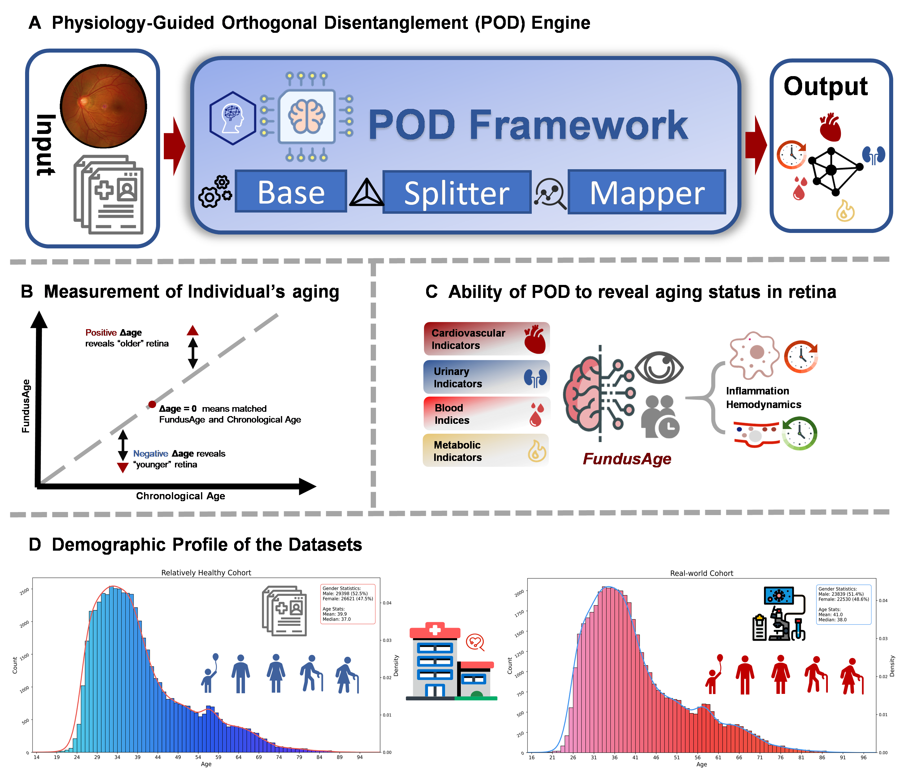

# PODE: Physiology-Guided Orthogonal Disentanglement Engine

**Official implementation of:**

> **PODE: A physiology-guided orthogonal disentanglement framework reveals heterogeneity in the retinal aging clock**

[](https://www.python.org/)
[](https://pytorch.org/)
[](LICENSE)

---

## Overview

PODE is an interpretable computational framework that moves retinal age modeling beyond scalar prediction toward **structured decomposition** of age-related and pathology-associated variation. Applied to fundus photography, PODE:

- **PODE-Base** — Establishes a state-of-the-art normative aging baseline (MAE = **2.48 years**, Pearson *r* = **0.963**) by fine-tuning the [VisionFM](https://doi.org/10.1056/AIoa2300221) foundation model on a healthy reference cohort of 56,019 individuals.
- **PODE-Splitter** — Decomposes the entangled retinal feature space into **six orthogonally regularized subspaces** (normative age + hemodynamic, metabolic, renal, hematologic, and immune residuals) via a teacher–student residual learning architecture. Isolating the normative trajectory further reduces MAE to **1.80 years** on independent healthy subjects.
- **PODE-Mapper** — Characterizes population-level heterogeneity across a real-world cohort of 46,369 individuals using XGBoost/SHAP feature attribution, Tabular Transformer attention analysis, and UMAP + K-means phenotypic clustering.

<p align="center">
  
</p>

---

## Key Results

| Model | Cohort | MAE (yr) | Pearson *r* | R² |
|---|---|---|---|---|
| PODE-Base | Healthy test set (N=11,202) | **2.48** | **0.963** | 0.928 |
| PODE-Splitter | Independent healthy subset | **1.80** | — | — |

XGBoost phenotypic stratification accuracy on real-world cohort:

| Phenotype Group | Accuracy |
|---|---|
| Decelerated aging (Q1–Q2) | 74.69% |
| Normative baseline (Q4–Q5) | 74.72% |
| Accelerated aging (Q7–Q8) | 74.84% |

---

## Repository Structure

```
PODE/
├── shared/                          # Shared utilities across all modules
│   ├── data_utils.py               # AgeDataset, image transforms, collate_fn
│   ├── metrics.py                  # Regression metrics logger
│   ├── prepare_dataset.py          # Bulk fundus image downloader
│   ├── img_csv_resize.py           # Fundus ROI crop + 224×224 resize
│   ├── clean_csv_error.py          # Remove corrupted entries from manifest
│   └── find_error_img.py           # Detect unreadable images
│
├── pode_base/                       # Module 1: Normative Aging Baseline (Fig. 2)
│   ├── model.py                    # AgePredictionViT: ViT-B/16 + regression head
│   ├── train.py                    # Training with age-balanced WeightedRandomSampler
│   ├── evaluation/
│   │   ├── evaluate.py             # Reproducible split inference → inference_details.csv
│   │   └── evaluation_utils.py    # Scatter / residual / Bland–Altman plotting
│   ├── visualization/
│   │   ├── gradcam_visualize.py   # Grad-CAM saliency maps
│   │   └── attention_rollout_visualize.py  # Attention Rollout maps
│   └── downstream_analysis/
│       ├── scatter_lowess.py       # Fig. 3: Δage trajectories across disease groups
│       └── octile_violin_box.py    # Supp. Fig. 1: Δage octile stratification
│
├── pode_splitter/                   # Module 2: Physiological Disentanglement (Fig. 5)
│   ├── model.py                    # DisentangledVisionFM_V2 (6 orthogonal subspaces)
│   ├── loss.py                     # Composite loss: task + orthogonal regularization
│   ├── metrics.py                  # Multi-task metrics logger
│   ├── train.py                    # Three-stage training protocol
│   ├── evaluate.py                 # Multi-task evaluation
│   └── prediction_analysis/
│       ├── predict.py              # Batch inference → predictions_v2.xlsx
│       ├── run_pipeline.py         # Full Fig. 5B inference + performance plots
│       ├── plotting.py             # Scatter / Bland–Altman / error distribution
│       ├── analyze_orthogonality.py  # Fig. 5C: Z-subspace Pearson correlation heatmap
│       ├── manhattan_advanced.py   # Fig. 5D: Targeted PheWAS Manhattan plot
│       └── umap_3D_app.py         # Interactive 3D subspace explorer (Streamlit)
│
├── pode_mapper/                     # Module 3: Phenotypic Mapping (Fig. 4, Supp. 2–3)
│   ├── xgboost_shap/
│   │   └── xgboost_shap_analysis.py  # Supp. Fig. 2: XGBoost + SHAP beeswarm
│   ├── tabular_transformer/
│   │   ├── model.py / dataset.py / data_utils.py
│   │   ├── train.py                  # TabTransformer: clinical+FundusAge → True Age
│   │   └── attention_analyze.py      # Supp. Fig. 3: FundusAge attention heatmap
│   └── umap_clustering/
│       ├── generate_umap.py          # UMAP projection (Fig. 4B)
│       ├── kmeans_clustering.py      # K-means k=18, bubble plot data (Fig. 4C/E)
│       └── silhouette_reliability.py # Cluster quality analysis (Fig. 4A/D)
│
├── fig_draw/                        # Standalone paper figure scripts
│   ├── scatter_plot_performance.py  # Fig. 2B
│   ├── bias_check_performance.py    # Fig. 2C/D
│   └── bland-altman_performance.py  # Fig. 2E
│
├── requirements.txt
└── pipeline.md                      # This file
```

---

## Installation

### Requirements

- Python ≥ 3.10
- PyTorch ≥ 2.0 with CUDA 11.8+
- GPU with ≥ 16 GB VRAM (required for PODE-Splitter training; evaluation is CPU-compatible)

### Setup

```bash
git clone https://github.com/<your-repo>/PODE.git
cd PODE

# Create environment
conda create -n PODE python=3.12 -y
conda activate PODE

# Install dependencies
pip install -r requirements.txt
```

**Core packages** (verified versions):

| Package | Version |
|---|---|
| torch + torchvision | 2.9.1 + 0.24.1 |
| timm | 1.0.24 |
| numpy / pandas / scipy | 2.2.6 / 2.3.3 / 1.17.0 |
| scikit-learn | 1.8.0 |
| xgboost / shap | 3.2.0 / 0.51.0 |
| statsmodels / umap-learn | 0.14.6 / 0.5.11 |
| matplotlib / seaborn | 3.10.8 / 0.13.2 |

> See `requirements.txt` for the complete pinned version list.

### Important: Running the Code

All modules use Python relative imports and **must be invoked as packages** from the repository root:

```bash
# ✅ Run from the parent directory of PODE/
cd /path/to/PycharmProjectsStorage     # or wherever PODE/ is located

python -m PODE.pode_base.evaluation.evaluate --model_path ... --manifest_path ...
python -m PODE.pode_splitter.train --data_path ...

# ✅ Standalone scripts (no relative imports) can be run directly
python PODE/fig_draw/scatter_plot_performance.py --predictions ...
python PODE/pode_mapper/xgboost_shap/xgboost_shap_analysis.py
```

---

## Pre-trained Models

| Model | Description | Download |
|---|---|---|
| `VFM_Fundus_weights.pth` | VisionFM backbone (MAE pre-trained on 3.4M ophthalmic images) | [VisionFM](https://doi.org/10.1056/AIoa2300221) |
| `best_model_dp.pth` | PODE-Base fine-tuned weights (MAE = 2.48 yr) | Coming soon |
| `best_model_v2.pth` | PODE-Splitter weights | Coming soon |

Place downloaded weights in your preferred directory and pass the path via `--model_path` / `--mae_weights_path`.

---

## Data

### Cohort Overview

| Cohort | N (subjects) | Images | Usage |
|---|---|---|---|
| **Healthy Reference Cohort** | 56,019 | 112,019 fundus images | PODE-Base training/evaluation |
| **Real-World Clinical Cohort** | 46,369 | binocular fundus pairs | PODE-Splitter training; PODE-Mapper analysis |

All participants underwent same-day fundus photography and comprehensive clinical assessment (blood panels, urinalysis, ECG, carotid ultrasound). Detailed inclusion/exclusion criteria are described in the paper Methods.

### Data Preparation

**Step 1: Image download** (if starting from raw URLs)

```bash
# Add unique ID column to the input spreadsheet
python -c "
import pandas as pd
df = pd.read_excel('<PATH_TO_BLANK_XLSX>')
df.insert(0, 'id', range(len(df)))
df.to_csv('blank_with_id.csv', index=False)
"

python -m PODE.shared.prepare_dataset \
    --input_file  blank_with_id.csv \
    --image_dir   data/images/ \
    --output_dir  data/ \
    --id_col id  --target_col Age \
    --url_col_1 left  --url_col_2 right \
    --max_workers 20
# Outputs: data/manifest.csv, data/download_log.csv
```

**Step 2: Fundus ROI crop + resize to 224×224**

```bash
python -m PODE.shared.img_csv_resize \
    --manifest_path   data/manifest.csv \
    --output_dir      data/images_resized/ \
    --output_manifest data/resized_manifest.csv \
    --image_size 224  --num_workers 16
```

The preprocessing pipeline: (i) grayscale thresholding (pixel > 20) to isolate the fundus disc, (ii) minimum bounding box crop with 5-pixel padding, (iii) resize + center crop to 224×224.

### Data Availability & Synthetic Data Generation

Due to institutional ethics and patient privacy regulations, the complete real-world clinical dataset (`full_age_02.xlsx`) cannot be publicly shared. To enable pipeline verification, we provide a synthetic data generation script.

**Generate dummy clinical data for pipeline testing:**

```python
import pandas as pd
import numpy as np
import os

# Create data directory
os.makedirs('data/images', exist_ok=True)

# Generate 100 dummy subjects
n_subjects = 100
dummy_data = pd.DataFrame({
    'id': range(n_subjects),
    'Age': np.random.randint(20, 80, n_subjects),
    'teacher_age': np.random.uniform(20, 80, n_subjects),
    'delta_age': np.random.uniform(-10, 10, n_subjects),
    'lefteye_path': [f'data/images/dummy_{i}_L.jpg' for i in range(n_subjects)],
    'righteye_path': [f'data/images/dummy_{i}_R.jpg' for i in range(n_subjects)],
    'SBP': np.random.uniform(90, 180, n_subjects),
    'DBP': np.random.uniform(60, 110, n_subjects),
    'BMI': np.random.uniform(18, 35, n_subjects),
    'FBG': np.random.uniform(4.0, 10.0, n_subjects),
    'TG': np.random.uniform(0.5, 5.0, n_subjects),
    'TC': np.random.uniform(3.0, 7.0, n_subjects),
    'LDL-C': np.random.uniform(1.0, 5.0, n_subjects),
    'HDL-C': np.random.uniform(0.8, 2.5, n_subjects),
    'WBC': np.random.uniform(4.0, 10.0, n_subjects),
    'HGB': np.random.uniform(110, 170, n_subjects),
    'Creatinine': np.random.uniform(50, 120, n_subjects),
    'BUN': np.random.uniform(3.0, 8.0, n_subjects),
})

dummy_data.to_excel('data/full_age_02_dummy.xlsx', index=False)
print(f"✅ Dummy dataset generated: {len(dummy_data)} subjects → data/full_age_02_dummy.xlsx")
```

> For fundus image testing, any set of 224×224 RGB images can be used as placeholders. The PODE-Splitter and PODE-Mapper can be validated end-to-end with this synthetic data.

---

## Usage

### 1. PODE-Base

**Training**

```bash
python -m PODE.pode_base.train \
    --manifest_path    data/resized_manifest.csv \
    --mae_weights_path <PATH_TO_VFM_WEIGHTS> \
    --output_dir       outputs/pode_base \
    --epochs 100       --batch_size 128 \
    --backbone_lr 1e-5 --head_lr 1e-4
```

The training uses inverse-frequency weighted sampling across 10-year age bins to mitigate regression-to-the-mean bias (see paper §Methods).

**Evaluation**

```bash
python -m PODE.pode_base.evaluation.evaluate \
    --model_path    outputs/pode_base/best_model_dp.pth \
    --manifest_path data/resized_manifest.csv \
    --output_dir    outputs/pode_base/eval \
    --split_to_evaluate test
# Outputs: eval/test_split_results/inference_details.csv (True_Age, Predicted_Age, Error)
```

**Generate Fig. 2 performance plots**

```bash
PRED=outputs/pode_base/eval/test_split_results/inference_details.csv
FIGS=outputs/pode_base/figs

python PODE/fig_draw/scatter_plot_performance.py --predictions $PRED --output_dir $FIGS
python PODE/fig_draw/bias_check_performance.py   --predictions $PRED --output_dir $FIGS
python PODE/fig_draw/bland-altman_performance.py --predictions $PRED --output_dir $FIGS
```

---

### 2. PODE-Mapper

**Build the master clinical table** (`full_age_02.xlsx`)

Run PODE-Base inference on the clinical cohort, then merge with clinical indicators:

```bash
python -m PODE.pode_base.evaluation.evaluate \
    --model_path    outputs/pode_base/best_model_dp.pth \
    --manifest_path data/mixed_cohort_manifest.csv \
    --output_dir    outputs/mixed_cohort_eval

python -c "
import pandas as pd
pred = pd.read_csv('outputs/mixed_cohort_eval/test_split_results/inference_details.csv')
clin = pd.read_csv('data/train__resized.csv', low_memory=False)
clin['Predicted_Age'] = pred['Predicted_Age'].values
clin['delta_age']     = clin['Predicted_Age'] - clin['Age']
clin['teacher_age']   = clin['Predicted_Age']
clin.to_excel('data/full_age_02.xlsx', index=False)
"
```

> The `teacher_age` column anchors PODE-Splitter's normative baseline — **do not omit it**.

**XGBoost + SHAP phenotypic analysis** (Supp. Fig. 2)

```bash
python PODE/pode_mapper/xgboost_shap/xgboost_shap_analysis.py \
    --data data/full_age_02.xlsx \
    --output_dir outputs/xgboost_shap
```

**Tabular Transformer** (Supp. Fig. 3)

```bash
python -m PODE.pode_mapper.tabular_transformer.train \
    --data data/full_age_02.xlsx \
    --output_dir outputs/tab_transformer

python -m PODE.pode_mapper.tabular_transformer.attention_analyze \
    --data       data/full_age_02.xlsx \
    --checkpoint outputs/tab_transformer/best_model.pth \
    --scaler     outputs/tab_transformer/scaler.pkl \
    --output_dir outputs/tab_transformer/attn
```

**UMAP + K-means clustering** (Fig. 4)

```bash
# Fig. 4B: UMAP projection (coordinates saved to outputs/umap/umap_coordinates.csv)
python PODE/pode_mapper/umap_clustering/generate_umap.py \
    --data data/full_age_02.xlsx \
    --output_dir outputs/umap

# Fig. 4C + 4E: K-Means clustering on UMAP coordinates
python PODE/pode_mapper/umap_clustering/kmeans_clustering.py \
    --data      outputs/umap/umap_coordinates.csv \
    --output_dir outputs/kmeans \
    --n_clusters 18 \
    --target_col delta_age

# Fig. 4A + 4D: Silhouette analysis + ANOVA reliability validation
python PODE/pode_mapper/umap_clustering/silhouette_reliability.py \
    --data      outputs/umap/umap_coordinates.csv \
    --output_dir outputs/kmeans_reliability \
    --n_clusters 18
```

**LOWESS trajectory analysis and Δage stratification** (Fig. 3 + Supp. Fig. 1)

```bash
python PODE/pode_base/downstream_analysis/scatter_lowess.py       # Fig. 3 A–D
python PODE/pode_base/downstream_analysis/octile_violin_box.py    # Supp. Fig. 1 (set NUM_BINS=8)
```

---

### 3. PODE-Splitter

**Training** (three-stage protocol)

```bash
python -m PODE.pode_splitter.train \
    --data_path       data/full_age_02.xlsx \
    --image_col_left  lefteye_path \
    --image_col_right righteye_path \
    --age_col         Age \
    --teacher_age_col teacher_age \
    --pretrained_age_model outputs/pode_base/best_model_dp.pth \
    --output_dir       outputs/pode_splitter \
    --lambda_age_orth 1.0  --lambda_physio_orth 0.1 \
    --task_weights '{"hemodynamic":1.0,"metabolic":1.0,"renal":1.0,"hematologic":1.0,"immune":1.0}' \
    --stage1_epochs 5  --stage2_epochs 10  --stage3_epochs 15 \
    --batch_size 32    --enable_amp
# Outputs: best_model_v2.pth, model_config_v2.pth, scaler_params.pth
```

Training stages:

| Stage | Epochs | lr | Frozen | Purpose |
|---|---|---|---|---|
| 1 | 5 | 1e-4 | backbone, age projector | Learn physiological subspaces independently |
| 2 | 10 | 1e-5 | all except `projectors.age` | Rotate age subspace to be orthogonal to physio subspaces |
| 3 | 15 | 1e-6 | nothing | End-to-end joint fine-tuning |

**Inference and Fig. 5 plots**

```bash
# Fig. 5B: Performance on independent healthy subset
python -m PODE.pode_splitter.prediction_analysis.run_pipeline \
    --data_path         data/full_age_02_healthy_subset.xlsx \
    --model_path        outputs/pode_splitter/best_model_v2.pth \
    --model_config_path outputs/pode_splitter/model_config_v2.pth \
    --output_dir        outputs/fig5b \
    --image_col_left lefteye_path  --image_col_right righteye_path  --age_col Age

# Fig. 5C: Z-subspace orthogonality heatmap
python -m PODE.pode_splitter.prediction_analysis.analyze_orthogonality \
    --data_path         data/full_age_02.xlsx \
    --model_path        outputs/pode_splitter/best_model_v2.pth \
    --model_config_path outputs/pode_splitter/model_config_v2.pth \
    --output_dir        outputs/fig5c \
    --image_col_left lefteye_path  --image_col_right righteye_path \
    --num_samples_for_analysis 2000

# Fig. 5D: Targeted PheWAS Manhattan plot
python PODE/pode_splitter/prediction_analysis/manhattan_advanced.py \
    --data_path  outputs/fig5b/predictions_v2.xlsx \
    --output_dir outputs/fig5d \
    --age_col    Age \
    --age-delta-cols Age_Delta_hemodynamic,Age_Delta_metabolic,Age_Delta_renal,Age_Delta_hematologic,Age_Delta_immune \
    --metric neg_log_pvalue \
    --plot-all-components
```

---

## Paper Figure Index

| Figure | Panel | Description | Script |
|---|---|---|---|
| **2** | B | Predicted vs. True Age scatter | `fig_draw/scatter_plot_performance.py` |
| **2** | C/D | Δage distribution and bias | `fig_draw/bias_check_performance.py` |
| **2** | E | Bland–Altman agreement | `fig_draw/bland-altman_performance.py` |
| **3** | A–D | Δage trajectories, healthy vs. disease | `pode_base/downstream_analysis/scatter_lowess.py` |
| **4** | A+D | K-means clustering + Silhouette analysis | `pode_mapper/umap_clustering/silhouette_reliability.py` |
| **4** | B | UMAP colored by continuous Δage | `pode_mapper/umap_clustering/generate_umap.py` |
| **4** | C+E | UMAP by Δage quartile + bubble plot | `pode_mapper/umap_clustering/kmeans_clustering.py` |
| **5** | B | PODE-Splitter performance (4 plots) | `pode_splitter/prediction_analysis/run_pipeline.py` |
| **5** | C | Z-subspace orthogonality heatmap | `pode_splitter/prediction_analysis/analyze_orthogonality.py` |
| **5** | D | Targeted PheWAS Manhattan | `pode_splitter/prediction_analysis/manhattan_advanced.py` |
| **Supp. 1** | A–H | Δage octile × clinical indicators | `pode_base/downstream_analysis/octile_violin_box.py` |
| **Supp. 2** | — | XGBoost + SHAP feature attribution | `pode_mapper/xgboost_shap/xgboost_shap_analysis.py` |
| **Supp. 3** | — | TabTransformer attention heatmap | `pode_mapper/tabular_transformer/attention_analyze.py` |

---

## Notes

**Column naming convention**: The master clinical table (`full_age_02.xlsx`) uses `delta_age` (underscore). Downstream scripts that reference this column must match this convention.

**Supp. Fig. numbering** (aligned with the published Methods section):
- Supp. Fig. 1 = Δage octile boxplot/violin
- Supp. Fig. 2 = XGBoost + SHAP feature importance
- Supp. Fig. 3 = Tabular Transformer attention heatmap

**Fig. 5B independent healthy subset**: Extract from `full_age_02.xlsx` using clinical thresholds (e.g., `AS_level == 0`, `SBP < 140`, `DBP < 90`, `FBG < 7`) to obtain the held-out normative reference population.

---

## Citation

Citation information will be added upon acceptance.

---

## Acknowledgements

This work builds upon [VisionFM](https://doi.org/10.1056/AIoa2300221), a vision foundation model pre-trained on 3.4 million ophthalmic images. We thank the development teams of [timm](https://github.com/huggingface/pytorch-image-models), [UMAP-learn](https://github.com/lmcinnes/umap), and [SHAP](https://github.com/shap/shap).

---

## License

This project is released under the [MIT License](LICENSE).
